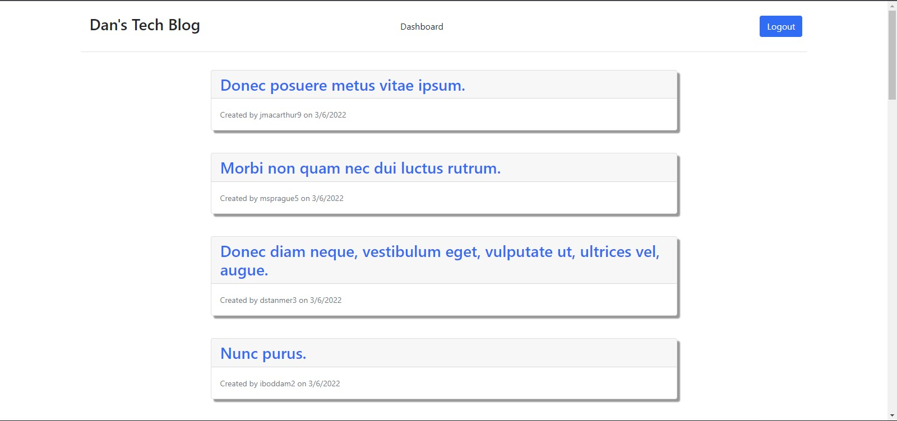

# Dan's Tech Blog

## Description

Fullstack program allowing people to create a log in and contribute to a tech blog.

## Table of Contents

* [Installation](#installation)
* [Usage](#usage)
* [Contributing](#contributing)
* [Tests](#tests)
* [Questions](#questions)

## Installation

Once the code is downloaded run "npm i" on the cmd line to download the dependencies required.

## Usage

The application is deployed to heroku please visit [Dan's Tech Blog](https://warm-sierra-83835.herokuapp.com) to use the app.

## Contributing

Standard practice for contribution.

## Tests

No test available ath this time.

## Questions

If you have an questions feel free to contact me via [Email](dsapione@gmail.com)
and checkout my other projects on [GitHub](https://github.com/dsapione).
